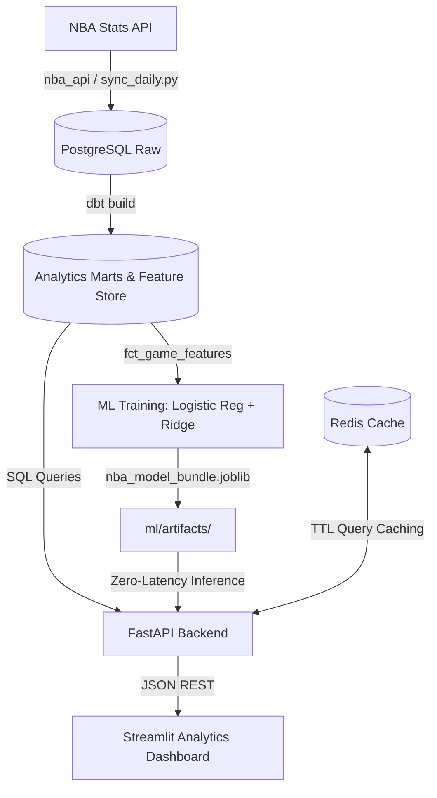

# ⚡ NBA Analytics Engine & Predictive Lakehouse

A production-grade NBA data lakehouse, predictive modeling engine, and interactive intelligence dashboard. Built with an automated ELT architecture using **PostgreSQL**, **dbt**, **scikit-learn**, **FastAPI**, **Redis**, and **Streamlit**.

---

## Architecture Overview



* **Storage & Lakehouse:** PostgreSQL with normalized relational staging, advanced rolling window marts, and indexed query tables.
* **Transformations & Feature Store:** dbt models computing schedule-adjusted ratings, 10-game rolling efficiency vectors, and rest differentials strictly prior to tip-off to eliminate lookahead bias.
* **Predictive ML:** Calibrated Logistic Regression (Win Probability) paired with Ridge Regression (Projected Point Margin).
* **High-Throughput Serving:** FastAPI with asynchronous execution, connection pooling, and sub-millisecond Redis endpoint caching.
* **Interactive UI:** Streamlit frontend powered by Plotly for four-quadrant efficiency mapping, single-game box telemetry, player dossiers, and live matchup forecasts.

---

## Key Features

### 1. Matchup Predictive Engine
* **Win Probability Distribution:** Calibrated classification pipeline predicting head-to-head outcomes.
* **Point Spread Estimation:** Continuous expected margin regression modeling.
* **Leakage-Free Feature Store:** Features generated with `ROWS BETWEEN 10 PRECEDING AND 1 PRECEDING` window frames, filtering exclusively for mature samples ($N \ge 10$ games).
* **Holdout Validation:** Evaluated via chronological 80/20 train/test splits (**70.7% accuracy**, **0.2032 Brier score**).

### 2. Interactive Analytics Dashboard
* **📊 Team Efficiency Matrix:** Four-quadrant Plotly scatter plot mapping Schedule-Adjusted Offensive vs. Defensive Ratings.
* **⚔️ Matchup Tale of the Tape:** Head-to-head statistical comparison, dynamic team logo resolution via ESPN CDN, and live ML projections.
* **👤 Player Intelligence & Contextual Logs:** Career and single-season shot profiles, boom/bust scoring categorization vs. 10-game rolling baselines, and contextual defensive tier splits.
* **📋 Single-Game Box Score & Telemetry:** On-demand matchup inspector displaying pace, composite possessions, team shooting totals, and player box scores with a default empty-state selector.
* **🔥 Scoring Surge Tracker:** Leaderboards tracking hottest and coldest players based on 10-game scoring differentials.

### 3. Data Pipelines & Automation
* **Batch Historical Backfill (`pipeline/backfill.py`):** Multi-year ingestion engine supporting regular season and playoff game logs with rate-limiting throttling.
* **Automated Daily Sync (`pipeline/sync_daily.py`):** Incremental daily updates detecting completed games, running `dbt build`, retraining ML models, and purging stale Redis cache keys.

---

## Project Structure

```text
nba-analytics-engine/
├── api/                        # FastAPI service layer
│   ├── cache.py                # Redis caching decorators & client
│   ├── database.py             # PostgreSQL connection lifecycle
│   ├── middleware.py           # Structured JSON request logging
│   └── main.py                 # REST API endpoints & ML inference logic
├── dashboard/                  # Streamlit application
│   └── app.py                  # Multi-tab interactive dashboard & Plotly charts
├── ml/                         # Machine learning pipelines
│   ├── artifacts/              # Serialized model bundles (.joblib)
│   └── train_model.py          # Feature extraction, validation, & model trainer
├── pipeline/                   # Ingestion & automation scripts
│   ├── sync_daily.py           # Incremental daily game sync
│   └── backfill.py             # Multi-season historical backfill
├── transform/                  # dbt analytics project
│   ├── dbt_project.yml
│   ├── profiles.yml
│   └── models/
│       ├── marts/
│       │   ├── core/           # dim_team_summary, player_game_stats
│       │   ├── analytics/      # dim_team_advanced_ratings, fct_player_rolling_stats
│       │   └── ml/             # fct_game_features (feature store mart)
│       └── staging/
├── docker-compose.yml          # Multi-container orchestration
├── requirements.txt            # Python dependencies
└── README.md
```

---

## Quickstart

### Prerequisites
* [Docker Desktop](https://www.docker.com/products/docker-desktop/) (Engine 24.0+)
* Git

### 1. Clone & Start Containers
```bash
git clone [https://github.com/WilliamZ07/nba-analytics-engine.git](https://github.com/WilliamZ07/nba-analytics-engine.git)
cd nba-analytics-engine
docker compose up -d
```

Services will initialize on the following local ports:
* **Streamlit UI:** [http://localhost:8501](http://localhost:8501)
* **FastAPI Docs:** [http://localhost:8000/docs](http://localhost:8000/docs)
* **PostgreSQL:** `localhost:5432` (`lakehouse`)
* **Redis:** `localhost:6379`

### 2. Build dbt Marts
Compile and populate the dimensional models, rolling stat windows, and the ML feature store:
```bash
docker compose run --rm api dbt build --project-dir transform --profiles-dir transform
```

### 3. Train Machine Learning Models
Train the calibrated win probability classifier and point spread regressor:
```bash
docker compose run --rm api python ml/train_model.py
```

---

## Pipelines & Incremental Syncing

### Daily Incremental Sync
To ingest games played yesterday, transform feature tables, and invalidate stale caches:
```bash
docker compose run --rm api python pipeline/sync_daily.py auto
```

### Multi-Season Historical Backfill
To backfill multiple prior seasons and playoff games (e.g., 2019-20 through 2024-25):
```bash
docker compose run --rm api python pipeline/backfill.py
```
*(Or specify custom start/end years: `docker compose run --rm api python pipeline/backfill.py 2018 2024`)*

---

## API Reference Summary

| Method | Endpoint | Description | Cache TTL |
| :--- | :--- | :--- | :--- |
| `GET` | `/health` | Lakehouse and Redis connection status | Real-time |
| `GET` | `/seasons` | Distinct season IDs loaded in the warehouse | 24 Hours |
| `GET` | `/analytics/team-ratings` | Opponent-adjusted net, off, def ratings & pace | 1 Hour |
| `GET` | `/analytics/predict-matchup` | ML win probability & point spread forecasting | 10 Min |
| `GET` | `/analytics/surging-players` | Top players performing above 10-game baseline | 10 Min |
| `GET` | `/games` | Completed game schedules and team scores | 30 Min |
| `GET` | `/games/{game_id}/boxscore` | Composite box score and player telemetry | 1 Hour |
| `GET` | `/players/{id}/splits` | Player context splits (Home/Away, W/L, Def Tier) | 30 Min |
| `DELETE` | `/cache` | Clears all active Redis endpoint cache keys | Immediate |

---

## Model Validation Metrics

Evaluated on chronological holdout testing sets (most recent 20% of mature regular season matchups):

| Model | Target | Algorithm | Key Metrics |
| :--- | :--- | :--- | :--- |
| **Win Probability** | `target_home_win` (0/1) | Scaled Logistic Regression ($C=0.1$) | **70.7% Accuracy**, **0.2032 Brier Score**, **0.7525 ROC-AUC** |
| **Point Margin** | `target_point_margin` ($\Delta \text{PTS}$) | Scaled Ridge Regression ($\alpha=10.0$) | **13.04 MAE**, **16.13 RMSE** |