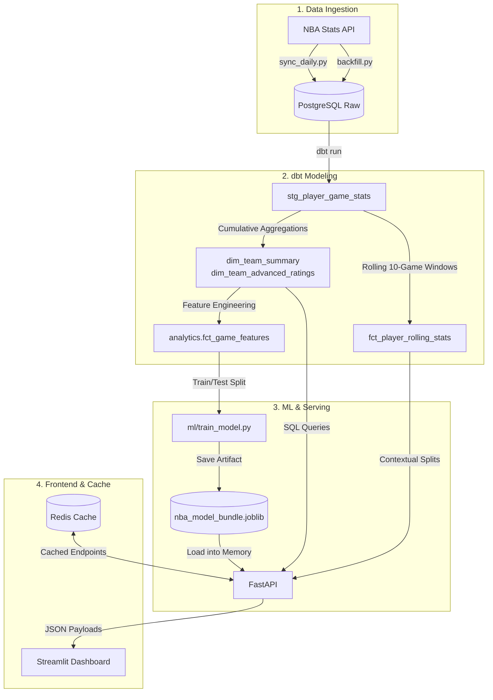

# ⚡ NBA Analytics Engine & Matchup Predictor

An end-to-end NBA data pipeline and analytics dashboard. It extracts game logs from the NBA API, builds rolling team and player metrics in PostgreSQL using dbt, trains game outcome and point spread models with scikit-learn, and serves everything through a FastAPI backend and a Streamlit UI with Redis caching.

---

## Architecture



* **Data Warehouse:** PostgreSQL storing normalized game logs, box scores, and dimensional marts.
* **Transformations & Feature Store:** dbt models computing schedule-adjusted ratings, 10-game rolling efficiency baselines, and rest differentials.
* **ML Pipelines:** Calibrated Logistic Regression for win probabilities and Ridge Regression for point spread estimates.
* **API Layer:** FastAPI with connection pooling and Redis endpoint caching (responses return in under 10ms on cached hits).
* **Frontend:** Streamlit dashboard with Plotly charts for four-quadrant team efficiency, single-game box scores, player shot logs, and head-to-head game predictions.

---

## How It Works: Stats & Feature Engineering

### 1. Possessions & Rating Calculations
Raw point totals don't tell the full story because teams play at very different paces. Every rating here is normalized per 100 possessions using the standard composite possession formula:

$$\text{Possessions} = 0.96 \times \left( \text{FGA} + 0.44 \times \text{FTA} - \text{OREB} + \text{TOV} \right)$$

$$\text{Offensive Rating} = 100 \times \left( \frac{\text{PTS}}{\text{Possessions}} \right), \quad \text{Defensive Rating} = 100 \times \left( \frac{\text{PTS Allowed}}{\text{Possessions}} \right)$$

$$\text{Net Rating} = \text{Offensive Rating} - \text{Defensive Rating}$$

### 2. Schedule Adjustments
A team that blows out bottom-feeders will have an artificially inflated Net Rating. The `dim_team_advanced_ratings` mart adjusts both offensive and defensive efficiency based on the defensive and offensive caliber of the opponents faced to date.

### 3. Preventing Data Leakage
Predicting games requires strict temporal safety. If you calculate a rolling average that accidentally includes the game being played, the model cheats:
* **Preceding Windows Only:** All rolling metrics use `ROWS BETWEEN 10 PRECEDING AND 1 PRECEDING` so the current game's stats are never visible to the feature row.
* **Sample Maturity Filter:** The `is_mature_sample` column flags games played within the first 10 games of the regular season. These are excluded from training so small-sample noise doesn't throw off model weights.
* **Rest Day Normalization:** Days between games are capped at 5 days to keep All-Star breaks and season openers from skewing schedule fatigue features.

---

## Model Evaluation

The models were evaluated using chronological holdout validation (training on the first 80% of games in the season and testing strictly on the final 20% to mirror real-life forecasting):

| Task | Model | Metric | Value | Baseline |
| :--- | :--- | :--- | :--- | :--- |
| **Win Probability** | `StandardScaler` + `LogisticRegression(C=0.1)` | **Accuracy** | **70.70%** | Uncalibrated: ~59% |
| **Win Probability** | `StandardScaler` + `LogisticRegression(C=0.1)` | **Brier Score** | **0.2032** | 0.2500 (Random guess) |
| **Win Probability** | `StandardScaler` + `LogisticRegression(C=0.1)` | **ROC-AUC** | **0.7525** | Solid separation |
| **Point Margin** | `StandardScaler` + `Ridge(alpha=10.0)` | **MAE** | **13.04 pts** | Expected NBA spread variance |
| **Point Margin** | `StandardScaler` + `Ridge(alpha=10.0)` | **RMSE** | **16.13 pts** | Dampens outlier blowouts |

---

## Project Structure

```text
nba-analytics-engine/
├── api/                        # FastAPI service
│   ├── cache.py                # Redis decorator & connection handling
│   ├── database.py             # PostgreSQL connection logic
│   ├── middleware.py           # Structured JSON request logger
│   └── main.py                 # Endpoints & ML inference route
├── dashboard/                  # Streamlit UI
│   └── app.py                  # Dashboard views, charts, and Tale of the Tape
├── ml/                         # Machine learning logic
│   ├── artifacts/              # Serialized .joblib model bundle
│   └── train_model.py          # Feature extraction & training script
├── pipeline/                   # Ingestion scripts
│   ├── sync_daily.py           # Daily incremental game fetcher
│   └── backfill.py             # Historical seasons & playoffs backfiller
├── transform/                  # dbt project
│   ├── dbt_project.yml
│   ├── profiles.yml
│   └── models/
│       ├── marts/
│       │   ├── core/           # dim_team_summary, player_game_stats
│       │   ├── analytics/      # dim_team_advanced_ratings, fct_player_rolling_stats
│       │   └── ml/             # fct_game_features (feature store)
│       └── staging/
├── docker-compose.yml          # Container configuration (Postgres, Redis, API, UI)
├── requirements.txt            # Python dependencies
└── README.md
```

---

## Quickstart

### Prerequisites
* [Docker Desktop](https://www.docker.com/products/docker-desktop/) (running Engine 24.0+)
* Git

### 1. Start the Containers
```bash
git clone [https://github.com/WilliamZ07/nba-analytics-engine.git](https://github.com/WilliamZ07/nba-analytics-engine.git)
cd nba-analytics-engine
docker compose up -d
```

Services will be accessible at:
* **Streamlit UI:** [http://localhost:8501](http://localhost:8501)
* **FastAPI Docs:** [http://localhost:8000/docs](http://localhost:8000/docs)
* **PostgreSQL:** `localhost:5432` (`lakehouse`)
* **Redis:** `localhost:6379`

### 2. Ingest Historical Data
Load historical seasons and playoffs (2019-20 through 2024-25 by default):
```bash
docker compose run --rm api python pipeline/backfill.py
```
*(To run a quick test with fewer years, pass specific years: `docker compose run --rm api python pipeline/backfill.py 2023 2024`)*

### 3. Build the dbt Marts
Run dbt to create the dimensional models, rolling averages, and feature tables:
```bash
docker compose run --rm api dbt build --project-dir transform --profiles-dir transform
```

### 4. Train the ML Models
Train the models and save the pipeline artifact:
```bash
docker compose run --rm api python ml/train_model.py
```

---

## Keeping Data Updated

### Daily Sync
To pull games that finished yesterday, update rolling tables, and bust stale Redis cache entries:
```bash
docker compose run --rm api python pipeline/sync_daily.py auto
```

### Automated Sync with Windows Task Scheduler
If you want updates to run automatically every morning at 4:00 AM (after games wrap up):
```powershell
$RepoPath = "C:\path\to\nba-analytics-engine"
$Action = New-ScheduledTaskAction -Execute "docker" -Argument "compose -f $RepoPath\docker-compose.yml run --rm api python pipeline/sync_daily.py auto"
$Trigger = New-ScheduledTaskTrigger -Daily -At 4:00AM
Register-ScheduledTask -TaskName "NBA_Lakehouse_Daily_Sync" -Action $Action -Trigger $Trigger -Description "Syncs latest completed NBA games"
```

---

## API Reference

| Method | Endpoint | Description | Cache TTL |
| :--- | :--- | :--- | :--- |
| `GET` | `/health` | Lakehouse and Redis connection health | No Cache |
| `GET` | `/seasons` | List of seasons currently stored in the database | 24 Hours |
| `GET` | `/analytics/team-ratings` | Schedule-adjusted offensive, defensive, and net ratings | 1 Hour |
| `GET` | `/analytics/predict-matchup` | ML win probability and spread projection for a matchup | 10 Min |
| `GET` | `/analytics/surging-players` | Players scoring furthest above their 10-game average | 10 Min |
| `GET` | `/games` | Completed game schedules, scores, and possessions | 30 Min |
| `GET` | `/games/{game_id}/boxscore` | Team summary and individual player box scores | 1 Hour |
| `GET` | `/players/{id}/splits` | Contextual player splits (Home/Away, Win/Loss, Defense Tier) | 30 Min |
| `DELETE` | `/cache` | Flushes all Redis query keys | Immediate |

---

## Data Validation

The data warehouse uses **28 dbt tests** running on every build:
* **Primary Key Constraints:** Uniqueness and non-null tests across `game_id`, `player_game_id`, and `team_game_id`.
* **Value Bounds:** Verifies target labels (`target_home_win` must be 0 or 1) and valid maturity ranges.
* **Referential Checks:** Ensures all box score records match valid game and team schedules.