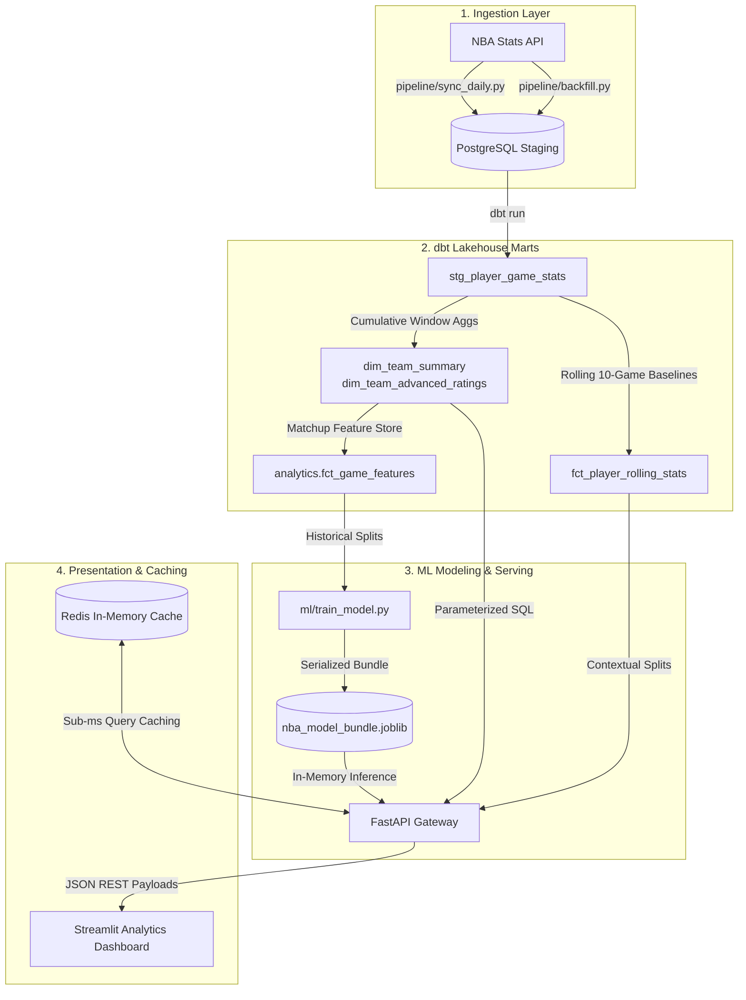

# ⚡ NBA Analytics Engine & Predictive Lakehouse

[](https://www.postgresql.org/)
[](https://www.getdbt.com/)
[](https://fastapi.tiangolo.com/)
[](https://redis.io/)
[](https://streamlit.io/)
[](https://scikit-learn.org/)

A production-grade NBA data lakehouse, predictive modeling engine, and interactive intelligence dashboard. Built with an automated ELT architecture using **PostgreSQL**, **dbt**, **scikit-learn**, **FastAPI**, **Redis**, and **Streamlit**.

---

## System Architecture



---

## Analytical Methodology & Data Science

### 1. Possession & Efficiency Formulas
Raw team point totals are distorted by game tempo. All ratings in this engine are normalized to **100 possessions** using the standard composite possession estimation:

$$\text{Possessions} = 0.96 \times \left( \text{FGA} + 0.44 \times \text{FTA} - \text{OREB} + \text{TOV} \right)$$

$$\text{Offensive Rating} = 100 \times \left( \frac{\text{Points Scored}}{\text{Possessions}} \right), \quad \text{Defensive Rating} = 100 \times \left( \frac{\text{Points Allowed}}{\text{Possessions}} \right)$$

$$\text{Net Rating} = \text{Offensive Rating} - \text{Defensive Rating}$$

### 2. Schedule & Opponent Adjustments
Raw Net Ratings reward teams with easy schedules. The dimensional mart `dim_team_advanced_ratings` calculates **Opponent-Adjusted Ratings** by weighting each matchup against the defensive and offensive caliber of the opponent relative to league average baselines.

### 3. Preventing Data Leakage in Feature Engineering
In sports modeling, using full-season averages to predict a game in November causes severe **lookahead leakage**. In `analytics.fct_game_features`:
* **Strict Temporal Framing:** Rolling statistics use `ROWS BETWEEN 10 PRECEDING AND 1 PRECEDING`, entirely excluding the game being predicted.
* **Maturity Filtering:** The `is_mature_sample` flag isolates contests where both teams have completed at least 10 prior regular-season games ($N \ge 10$), filtering out early-season statistical noise.
* **Rest Day Normalization:** Rest intervals are clamped between 0 and 5 days to eliminate off-season and All-Star break skew.

---

## Machine Learning & Validation Telemetry

Evaluated strictly on chronological holdout sets (the final 20% of mature regular season games, maintaining real-world forward-testing conditions):

| Target | Model Architecture | Metric | Value | Baseline Comparison |
| :--- | :--- | :--- | :--- | :--- |
| **Win Probability** (`target_home_win`) | `StandardScaler` + `LogisticRegression(C=0.1)` | **Accuracy** | **70.70%** | Uncalibrated baseline: ~59.0% |
| | | **Brier Score** | **0.2032** | Random guessing: 0.2500 (Lower is better) |
| | | **ROC-AUC** | **0.7525** | Strong discriminative ability |
| **Expected Spread** (`target_point_margin`) | `StandardScaler` + `Ridge(alpha=10.0)` | **MAE** | **13.04 pts** | NBA point spread volatility standard |
| | | **RMSE** | **16.13 pts** | Robust against blowout noise |

---

## Project Structure

```text
nba-analytics-engine/
├── api/                        # High-throughput FastAPI application
│   ├── cache.py                # Redis caching decorators & client pool
│   ├── database.py             # PostgreSQL connection management
│   ├── middleware.py           # Structured JSON request logging
│   └── main.py                 # REST API endpoints & ML inference logic
├── dashboard/                  # Streamlit application
│   └── app.py                  # Plotly dashboard, Tale of the Tape, Player Dossier
├── ml/                         # Machine learning pipelines
│   ├── artifacts/              # Serialized model bundles (.joblib)
│   └── train_model.py          # Training pipeline, holdout validation & metrics
├── pipeline/                   # Automated data orchestration
│   ├── sync_daily.py           # Incremental daily game sync & cache invalidation
│   └── backfill.py             # Multi-season historical backfill engine
├── transform/                  # dbt Lakehouse transformation project
│   ├── dbt_project.yml
│   ├── profiles.yml
│   └── models/
│       ├── marts/
│       │   ├── core/           # dim_team_summary, player_game_stats
│       │   ├── analytics/      # dim_team_advanced_ratings, fct_player_rolling_stats
│       │   └── ml/             # fct_game_features (18-dimension feature store)
│       └── staging/
├── docker-compose.yml          # Postgres, Redis, API, and Dashboard orchestration
├── requirements.txt            # Python dependencies
└── README.md
```

---

## Quickstart Guide

### Prerequisites
* [Docker Desktop](https://www.docker.com/products/docker-desktop/) (Engine 24.0+)
* Git

### 1. Clone & Start Containers
```bash
git clone [https://github.com/WilliamZ07/nba-analytics-engine.git](https://github.com/WilliamZ07/nba-analytics-engine.git)
cd nba-analytics-engine
docker compose up -d
```

Containers will initialize on the following local ports:
* **Streamlit Dashboard:** [http://localhost:8501](http://localhost:8501)
* **FastAPI Docs:** [http://localhost:8000/docs](http://localhost:8000/docs)
* **PostgreSQL:** `localhost:5432` (`lakehouse`)
* **Redis:** `localhost:6379`

### 2. Ingest Historical NBA Data
Load modern seasons (2019-20 to 2024-25, including playoffs):
```bash
docker compose run --rm api python pipeline/backfill.py
```
*(Or backfill a shorter test range: `docker compose run --rm api python pipeline/backfill.py 2023 2024`)*

### 3. Build dbt Transformation Marts
Compile and populate the dimensional models, rolling stat windows, and the ML feature store:
```bash
docker compose run --rm api dbt build --project-dir transform --profiles-dir transform
```

### 4. Train & Serialize the Machine Learning Models
Train the calibrated win probability classifier and point spread regressor:
```bash
docker compose run --rm api python ml/train_model.py
```

---

## Automated Pipelines & Maintenance

### Daily Incremental Sync
To ingest games completed yesterday, transform downstream marts, and clear Redis caches:
```bash
docker compose run --rm api python pipeline/sync_daily.py auto
```

### Automated Scheduling (Windows Task Scheduler)
To run incremental updates automatically every morning at 4:00 AM (after West Coast games conclude):
```powershell
$Action = New-ScheduledTaskAction -Execute "docker" -Argument "compose -f C:\Users\willi\OneDrive\Desktop\nba-analytics-engine\docker-compose.yml run --rm api python pipeline/sync_daily.py auto"
$Trigger = New-ScheduledTaskTrigger -Daily -At 4:00AM
Register-ScheduledTask -TaskName "NBA_Lakehouse_Daily_Sync" -Action $Action -Trigger $Trigger -Description "Syncs completed NBA games and updates dbt marts"
```

---

## API Reference Summary

| Method | Endpoint | Description | Cache TTL |
| :--- | :--- | :--- | :--- |
| `GET` | `/health` | PostgreSQL and Redis connection heartbeat | Real-time |
| `GET` | `/seasons` | Distinct season IDs dynamically queried from lakehouse | 24 Hours |
| `GET` | `/analytics/team-ratings` | Opponent-adjusted net, off, def ratings & pace | 1 Hour |
| `GET` | `/analytics/predict-matchup` | Real-time ML win probability & point spread forecasting | 10 Min |
| `GET` | `/analytics/surging-players` | Top players outperforming 10-game rolling baseline | 10 Min |
| `GET` | `/games` | Completed schedules, scores, and possession counts | 30 Min |
| `GET` | `/games/{game_id}/boxscore` | Composite box score and player telemetry | 1 Hour |
| `GET` | `/players/{id}/splits` | Contextual player splits (Home/Away, W/L, Def Tier) | 30 Min |
| `DELETE` | `/cache` | Flushes all active Redis endpoint cache keys | Immediate |

---

## Data Quality & Testing
The feature store and dimensional marts are validated using **28 dbt tests** running on every build:
* **Uniqueness & Non-Null Guarantees:** Strict primary key enforcement across `game_id`, `player_game_id`, and `team_game_id`.
* **Accepted Value Constraints:** Verifies target labels (`target_home_win` $\in \{0, 1\}$) and sample maturity indicators.
* **Referential Integrity:** Enforces relational boundaries between game box scores and dimensional schedules.